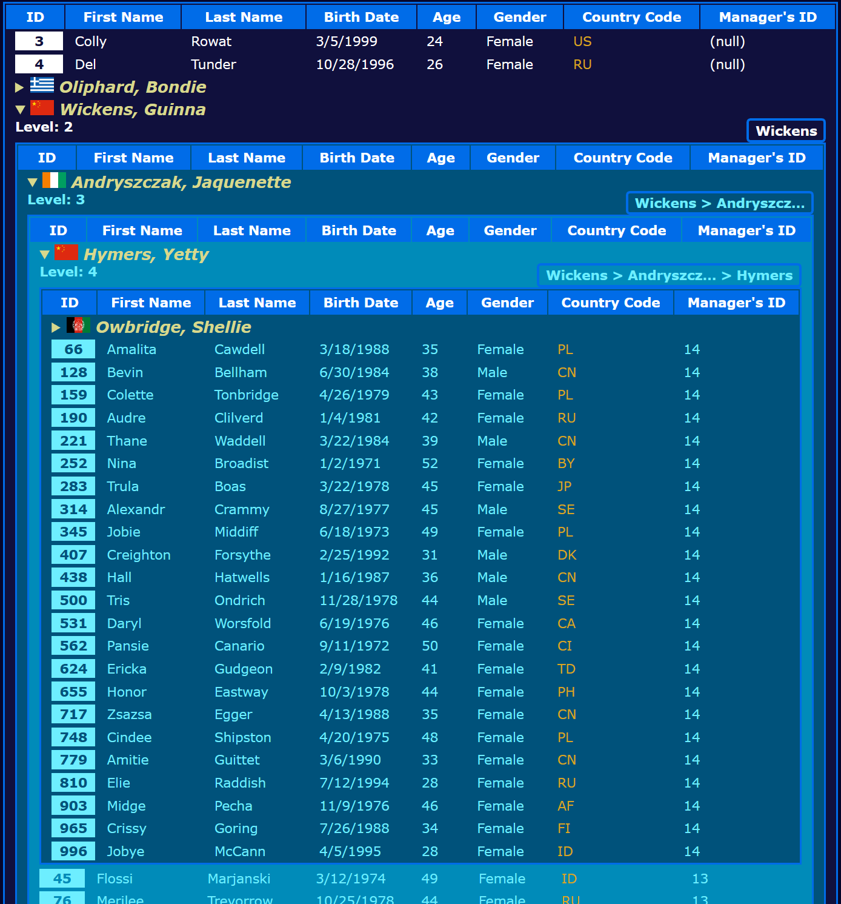

# svelte-htable

This is a hierarchical table component for Svelte.  This means that it is a table that may be provided with items that 
contain items, and said contained items need to be displayed as a sub-table.  The process can be repeated, producing 
an arbitrary amount of nested tables.  An image is worth a thousand words:



The styling shown in the example is not provided in the component itself.  It must be provided by assigning a CSS 
class to the table or by styling the `<table>` element and its sub-elements (`<th>`, `<td>`, etc).  Inner tables 
inherit any CSS classes that are applied to the parent, but further styling can be applied down the sub tables.  See 
the [Styling the Table](#styling-the-table) section of this ReadMe for details on the matter.

## Features

1. It is a recursive component.
2. Sub-tables can show a path and a level on top of it (this uses the table's `<caption>` element).
3. Sub-tables can be targetted for further styling.
4. It can group items so all items with sub-items are grouped together either before or after the items with no 
sub-items.
5. The summary of the elements with sub-items can be specified freely using either the value of a property, 
using completely arbitrary logic via a function, or create HTML markup using the `summary` slot.
6. The path in sub-tables can be generated by the value of a property or by using a function.
7. Column data can be rendered using a slot to allow for complex HTML content.
8. Column definitions allow the definition of a `render()` function to easily control data formatting or calculated 
columns.

## Quickstart

Install the package:

```bash
npm i svelte-htable
```

Now use it as `<Htable />` in a page or component.  The following example is in TypeScript to show how to extend the 
`Item` type to have Intellisense.  This is optional, as all of TypeScript.  Feel free to use JavaScript if you want.

**NOTE**:  This is an example use in a Svelte page (it receives the data from its `load()` function).

```ts
<script lang="ts">
    import
        Htable, { // Table component.
        CaptionOrder, // Enumeration to control the order of the data in captions.
        ItemGrouping, // Enumeration to control the item grouping behavior.
        type Column, // TypeScript type.  It represents a single table column definition.
        type Item, // Base TypeScript item type.  Extend this type as shown below.
    } from "svelte-htable";

    interface DataItem extends Item {
        first_name: string;
        last_name: string;
        email: string;
        gender: string;
        country_code: string;
        manager_id: number;
    }
    // This page expects the data to be provided through its load() function (Svelte stuff).
    export let data: { data: DataItem[] };
    // Define your table columns.
    const columns: Column[] = [
        {
            key: "id", // property name in the JS object
            title: "ID", // title shown in the column header
        },
        {
            key: "first_name",
            title: "First Name",
        },
        {
            key: "last_name",
            title: "Last Name",
        },
        {
            key: "birth_date",
            title: "Birth Date",
            render: (i, k) => new Date(i[k]).toLocaleDateString(), // Date formatting
        },
        {
            key: "gender",
            title: "Gender",
        },
        {
            key: "country_code",
            title: "Country Code",
        },
        {
            key: "manager_id",
            title: "Manager's ID",
        },
    ];
</script>
<!-- Now use the component. -->
<Htable
    items={data.data}
    {columns}
    level={true}
    showPath={true}
    summary={(i) => `${i.last_name}, ${i.first_name}`}
    pathSegment={(i) => i.last_name}
    pathSeparator=" > "
    maxPathSegmentLength={10}
/>
```

First import the Htable component, and if you need to, also import the `CaptionOrder` and the `ItemGrouping` 
enumerations, which are used to control the order of things in sub-tables' captions as well as item ordering in the 
tables (not shown in the example).

> **IMPORTANT**  This quickstart example will come out without styles at all.  It is up to you to provide the needed 
styling.

## Required Data Structure

If you haven't realized yet, your data needs to follow a specific structure.  Each item is expected to have `id` and 
`subItems` properties as per the definition of the `Item` data type.  Data items with a non-empty array in their 
`subItems` property will generate a sub-table, whose rows will be generated from the data items found in said array.

## Styling the Table

There are two ways to style the tables generated by `svelte-htable`.  The most straightforward approach would be to 
target the `<table>` element using a regular CSS file (so the classes are not scoped to a component), or a Svelte 
page/component file using `:global()` to avoid Svelte from scoping the CSS.  Then the table automatically picks the 
styles up as per the usual CSS rules.

The second way is to apply a CSS class to the component, declaring its styles either in a regular CSS file or a Svelte 
page/component file with `:global()`.  I would say this is probably the saner option because most likely you don't 
want to target other tables in your project by mistake.

This should cover the basics for styling, but the component allows finer targetting of its internal parts.

### Styling Sub-Tables

All sub-tables are decorated with the `sub` CSS class and also inherit the parent's CSS class.  This means that one 
can write CSS selectors of the form `table.sub`|`table.someClass.sub` (or `:global(table.sub|table.someClass.sub)`) to 
only target sub-tables.  The screenshot shown in this ReadMe used this technique to apply sub-tables a different text 
color.

Furthermore, the `sub-X` CSS class is applied to the tables, where `X` is the table's level.  The main table is level 
1, while all immediate sub-tables are level 2.  The main table has no extra CSS classes; the immediate sub-tables will 
have the `sub` and `sub-2` CSS classes.

But that's not all.  Sub-tables also get either the `sub-odd` or `sub-even` CSS classes depending on whether their 
level is odd or even.  This is helpful to achieve alternating per-table coloring.  The image shown at the beginning 
was created using these clases to apply alternating greenish backgrounds to sub-tables.

### Styling Expansibles

The expansibles are `<details>` HTML elements.  As per their usage, what is shown when the contents are collapsed is 
inside a `<summary>` HTML element.  You may style by targetting this element.  This is an example CSS that assumes the 
tables have been applied the `data` CSS class:

```css
table.data details > summary {
    /* Add the CSS for what is visible when the elements are collapsed. */
}
```

This `<details>` element spans all table columns.  The row that contains the element is further applied a `sub` CSS 
class to help styling.  An equivalent to the above could be:

```css
table.data tr.sub details > summary {
    /* Add the CSS for what is visible when the elements are collapsed. */
}
```

This is more specific than the previous example, so this should help in case specificity comes into play.

### Styling Sub-Table Captions

Sub-tables can show a caption on top with up to two pieces of information:  The table's level and the item's **path** 
value.  Since this is a table that displays hierarchical data, the concept of a path should be natural, and this is 
what is meant to be shown in the table's caption.  See the next section for information about this and other features.

The table's caption (a `<caption>` HTML element) is made up of two `<span>` elements inside an inline-flexed `<span>` 
element.  Each of these are assigned a CSS class based on their position.  The one to the left has the `cpt-l` CSS 
class; the one to the right, `cpt-r`.  Use these classes to style the pieces of information shown in the caption.

> **NOTE**:  What's shown to the left or the right depends on the value of the `captionOrder` prop as explained in the 
next section.

## Htable's Props

The following is the complete list of supported props:

| Property | Type | Description | Example |
| - | - | - | - |
| `columns` | `Column[]` | Required.  Column definitions. | `[{ key: 'id', name: 'ID'}]` |
| `items` | `Item[]` | Required.  Data items. | `[{ id: 1, name: 'John', subItems: [{ id: 2, name: 'Clara' }]}]` |
| `class` | String | Optional.  Used to apply CSS class(es). | `"my-css-data-table"` |
| `level` | `boolean \| ((level: number) => string)` | Optional.  When using a Boolean value, it shows or hides the level in caption; when providing a function, it is used to create what shows up as **Level** in the caption. | `true`; `l => 'Level: ' + l` |
| `showPath` | Boolean | Optional (defaults to `false`).  Set to true to show the sub-tables' paths in their captions. | `true` |
| `pathSeparator` | String | Optional (defaults to `'.'`).  Divider used to join path segments to create sub-tables' paths. | `' > '` |
| `captionOrder` | Number (`CaptionOrder`) | Optional (defaults to `CaptionOrder.PathLevel`).  Specifies which data goes where in sub-tables' captions. | `CaptionOrder.LevelPath` |
| `grouping` | Number (`ItemGrouping`) | Optional (defaults to `ItemGrouping.ExpansiblesFirst`).  Specifies how to group data items based on the existence of sub-items in them. | `ItemGrouping.ExpansiblesLast` |
| `summary` | `string \| ((item: Item) => string)` | Optional.  Used to control what is shown as the expansible item's summary. | `i => i.name` |
| `pathSegment` | `string \| ((item: Item) => string)` | Optional.  Used to define sub-tables' paths. | `i => i.employeeId` |
| `maxPathSegmentLength` | Number | Optional.  If specified, path segments that exceed this length will be truncated. | `10` |
| `buildLevel` | `(level: number) => string` | Optional.  Used to build the text that appears as **Level** in the sub-tables' captions. | `l => 'level: ' + l` |

## Caption-Related Props

A sub-table's caption may display up to two pieces of data:  The sub-table's level and path.  One can specify on which 
side of the caption each value appears using the `captionOrder` prop, and whether or not they appear using the `level` 
and `showPath` props.

The `captionOrder` prop accepts any value of the `CaptionOrder` enumeration:

| Name | Numerical Value | Description |
| - | - | - |
| `PathLevel` | 1 | The sub-tables' captions will show the table's path to the left and the table's level to the right. |
| `LevelPath` | 2 | The sub-tables' captions will show the table's level to the left and the table's path to the right. |

### About Path

A sub-table's path is automatically constructed by using the data item's first property as defined by the column 
definitions, unless the `pathSegment` prop is specified with either a data item's property name, or a function that 
takes the data item as function argument and returns the actual path segment value to use.  Each path segment is 
joined with other segments using the value of the `pathSeparator` prop.  If not specified, the default path separator 
is a period (`.`).  Any string can be used as path separator, but since the sub-table's caption's real estate is very 
limited, try not to use long separators.

Because of this limited real estate in captions, and most likely because your data will be dynamic in nature and 
therefore unpredictable, this component allows the specification of a maximum path segment length to help prevent 
overrunning the available space for both the level and the path data.  It works like this:  A path segment's value is 
obtained and measured against the value specified in the `maxPathSegmentLength` prop.  If the length exceeds the 
specification, then the path segment is truncated and ellipsis (`...`) is added at the end, so that the combined 
length is equal to `maxPathSegmentLength`.

The value of `maxPathSegmentLength` must be greater than 2.  The component doesn't check this in runtime; you'll just 
see an error if you go below this value.

### About Level

The level is just a measure of how deep the data has gone in terms or recursion  The top table is level 1, and as 
tables are recursively created, the level is increased by one.  Tables with a level greater than one are called 
sub-tables and are granted special CSS classes as seen in the [Styling the Table](#styling-the-table) section.

Since the table can be used to display text in any language, `svelte-htable` cannot possibly add any text to the 
label by itself.  So, in order to be able to display a simple string like `Level: 2`, you must provide a function 
via the `level` prop.  Sure, you can just set `level="true"` and the level is displayed, but it will only display 
the number, which turns out to be uninformative.  Still, the use of this prop is simple enough:

```ts
<Htable {columns} {items} level={l => `Level: ${l}`} />
```

This does the simple trick of outputting the level labeled with the word **Level**.

## Grouping Items

It may be desirable to rearrange the tables' rows according to their nature (expansible vs. non-expansible), so this 
component exposes the `grouping` prop.  This prop accepts any value of the `ItemGrouping` enumeration.

| Name | Numerical Value | Description |
| - | - | - |
| `Undefined` | 0 | The provided data items will be presented in the order they were provided. |
| `ExpansiblesFirst` | 1 | The provided data items will be rearranged so the ones with sub-items will be shown first. |
| `ExpansiblesLast` | 2 | The provided data items will be rearranged so the ones with sub-items will be shown last. |

## Defining the Summaries

The summaries are the the text shown for expansible items.  Said items are represented with a `<details>` HTML element 
that spans all table columns and its content is configurable.  As per the HTML specification, the first child of this 
`<details>` element is a `<summary>` element.

The contents of the `<summary>` element are what's displayed when the element is collapsed.  It is called the 
**summary** for obvious reasons.  After the summary, the sub-table is shown.

There are two ways to control what is shown in the summary:  By using the `summary` prop, or by using the `summary` 
slot.

### The Summary Slot

This would be the preferred option.  Use the named slot `summary` to customize what is shown as the expansible conent.

This is taken from the test application in this repository:

```ts
<Htable
    class="data"
    items={buildData(data.data)}
    {columns}
    level={l => `Level: ${l}`}
    showPath={true}
    captionOrder={CaptionOrder.LevelPath}
    summary={(i) => `${i.last_name}, ${i.first_name}`}
    grouping={ItemGrouping.ExpansiblesFirst}
    pathSegment={(i) => i.last_name}
    pathSeparator=" > "
    maxPathSegmentLength={10}
>
    <svelte:fragment slot="summary" let:item>
        &nbsp;{item.last_name},&nbsp;{item.first_name}
    </svelte:fragment>
</Htable>
```

A Svelte fragment is being used to set the slot's content to an image and the employee's name in the 
`<last name>, <first name>` format.  This is what you see in the example screenshot at the beginning of this document.

The example also shows the use of the `summary` prop.  When both are specified, the slot version will win.

### The Summary Prop

The other way to set the the summary would be to use the `summary` prop.  It can be a string, in which case it is 
assumed to be the name of a property in the item, or it can be a function that accepts the item and returns whatever 
you want as text in the summary.

If the example above did not use the summary slot, the function you see in the `summary` prop would be used, creating 
a very similar summary, only this one would not contain the image the summary-slotted version produces.

## Controlling Column Content

It is sometimes necessary to format data because the raw data might not be very friendly.  For example, dates in the 
ISO-8601 format are not much of a looker.  To account for this, column definitions may define a `render()` function 
that is called to obtain the column's contents.  If the function is not defined, `svelte-htable` provides a default 
function that only does 2 things:

1. Undefined values are exchanged with empty strings.
2. Null values are represented as `(null)`.

> **IMPORTANT**: Any empty strings are replaced by the `column` slot's default template with a non-breaking space 
(`&nbsp;`) to ensure cell formatting, and you should too, if you opt to use the `column` slot.

All render functions are given 2 arguments:  The row's item, and the column's key.

### Computed Columns

The `render()` function can be used to create calculated columns.  The example screenshot at the top shows the **Age** 
column, which is calculated by using the following column definition in the `columns` array:

```ts
        {
            key: "age",
            title: "Age",
            render: (i, k) => {
                const diff = Date.now() - Date.parse(i.birth_date);
                return Math.floor(
                    diff / (365 * 24 * 60 * 60 * 1000)
                ).toString();
            },
        },
```

This method will only take you so far, and if complex HTML is needed inside the table cell, then you must opt to use 
the `column` slot.

> **Tip**:  You can, and is encouraged to, combine the use of `render()` with the `column` slot.

### Customizing Columns With a Slot

Dynamic slots don't seem to be a thing (yet) in **Svelte**, so there is a single slot for all columns, and in order to 
use it, one must use an `{#if}` block to differentiate between table cells.

This following example is what has been used to create the example screenshot:

```html
    <svelte:fragment slot="column" let:item let:col let:render>
        {#if col.key === "id"}
            <span class="inverted">{render(item, col.key)}</span>
        {:else if col.key === "country_code"}
            <a
                href="https://flagpedia.net/{item.country_code.toLowerCase()}"
                target="_blank">{render(item, col.key)}</a
            >
        {:else}
            {@const value = render(item, col.key)}
            {#if value}
                {value}
            {:else}
                &nbsp;
            {/if}
        {/if}
    </svelte:fragment>
```

The slot provides 3 pieces of data:  The row's item, the column definition object and the column's `render()` 
function, but it is not exactly the one found in the column definition object.  While column definitions may not 
carry a `render()` function (and therefore `col.render` may very well be `undefined`), this slot-provided function is 
guaranteed to exist.  How?  Simple:  This is the defined `render()` function inside the column definition object, 
**or** the default `render()` function explained in the previous section.

---

If you have questions or would like to report a bug, feel free to open an issue.
